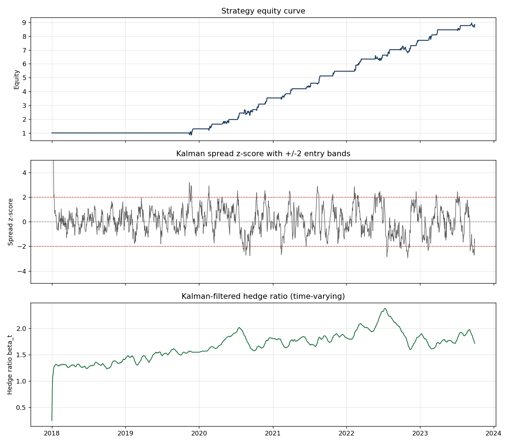

# Cointegrated Pairs Trading Engine with Kalman-Filtered Hedge Ratio

A statistical-arbitrage backtesting engine that trades the mean-reverting spread
between two cointegrated assets, using a **Kalman filter** to track a
*time-varying* hedge ratio instead of a static rolling-window regression.

The design goal is not a novel alpha signal — it is a **clean, honest
implementation** of a well-understood structural anomaly, with the execution and
risk details (transaction costs, stop-loss, look-ahead avoidance) handled
properly. Those details are where most pairs-trading backtests quietly cheat.

---

## Why a Kalman filter?

Classic pairs trading estimates the hedge ratio `β` by regressing one asset on
the other over a rolling window. This has a built-in dilemma: a short window is
noisy, a long window is stale, and either way you've baked in a lookback bias.

The Kalman filter reframes `β` as a hidden state that **updates every day**:

```
observation:  y_t = β_t · x_t + α_t + ε_t        ε_t ~ N(0, R)
state evo.:   [β_t, α_t] = [β_{t-1}, α_{t-1}] + w_t   w_t ~ N(0, Q)
```

So the regression coefficients are themselves a slow random walk. Each new price
nudges the estimate via the Kalman gain. There is no window — the filter has a
fading memory governed by the process-noise scale `delta`. Keep `delta` small
(`1e-5`–`1e-4`) so `β` tracks genuine regime drift without chasing daily noise.

The **innovation** `ε_t` (the one-step-ahead prediction error of `y_t`) is the
spread we trade. Because it is a forecast error computed *before* seeing `y_t`,
it is naturally free of look-ahead bias, and the filter hands us its variance
`S_t` directly — so we standardize the spread as `z_t = ε_t / √S_t` without a
second rolling window.

---

## Trading logic

With `z_t` the standardized spread:

| Condition            | Action                                        |
|----------------------|-----------------------------------------------|
| `z_t < −2`           | Go **long** the spread (buy Y, sell β·X)      |
| `z_t > +2`           | Go **short** the spread (sell Y, buy β·X)     |
| `z_t` crosses 0      | **Exit** to flat                              |
| `|z_t| > 4`          | **Stop out** — pair likely de-cointegrated    |

Positions are generated by an explicit state machine (entry/exit depend on the
*path* of `z`, not just its level) and the signal is traded on the **next** bar's
return to avoid acting on the bar that produced it.

---

## Project structure

```
pairs_engine/
├── data_loader.py    # yfinance loader + synthetic cointegrated-pair generator
├── models.py         # Engle-Granger screening + KalmanHedgeRatio
├── backtester.py     # signal state machine, costs, stop-loss, P&L accounting
├── analytics.py      # Sharpe / Sortino / max drawdown + plotting
└── run_pipeline.py   # end-to-end driver (synthetic by default, --live for real)
```

---

## Quickstart

```bash
pip install numpy pandas statsmodels matplotlib
# yfinance is only needed for live data:
pip install yfinance

# Run end-to-end on synthetic data (no network needed):
python run_pipeline.py

# Run on a real ETF pair:
python run_pipeline.py --live SPY IVV
```

The synthetic path generates a pair with a **known** hedge ratio that drifts
from 1.2 → 1.8, plus a mean-reverting AR(1) spread. It is the engine's unit test:
if the Kalman filter can't recover a `β` you generated yourself, the bug is in
the code, not the market. (It recovers it to within ~0.2 on the back half.)

---

## Example output (synthetic pair)

```
Cointegration screen:   coint_pvalue = 4.9e-09   passes = True

Total return                    779.49%
Annualized return               130.95%
Annualized vol                   60.05%
Sharpe                             2.18
Sortino                            1.33
Max drawdown                    -21.75%
Max DD duration (bars)                3
Num trades                           43
```



The three panels show the additive equity curve, the spread z-score with its ±2
entry bands, and the time-varying hedge ratio climbing to track the drift built
into the synthetic data.

---

## Reading these numbers honestly

**These results are on synthetic data engineered to be tradeable.** A clean
cointegrated pair with a strong mean-reverting spread and no structural breaks
*should* produce a high Sharpe — that only confirms the plumbing works, not that
the strategy is profitable on real markets. Expect real ETF/equity pairs to
deliver Sharpe ratios that are a fraction of this, with longer flat periods.

What *does* validate the engine is how it behaves when conditions worsen, both
of which it handles correctly:

* **Transaction costs bite monotonically.** Raising costs from 0 → 100bps lowers
  the Sharpe steadily. The effect is modest here only because a single pair
  trades infrequently (~43 trades over six years).
* **De-cointegration is punishing.** If the pair permanently breaks mid-sample,
  the strategy loses essentially all its capital (Sharpe goes negative, drawdown
  > 100%). The `|z| > 4` stop-loss helps only marginally — it cannot rescue you
  from a true regime break. **This is the central risk of pairs trading and the
  engine does not hide it.**

---

## Known limitations & natural extensions

* **Cointegration is not permanent.** The single biggest real-world risk. A
  production version should periodically *re-test* cointegration and retire pairs
  whose relationship has decayed, rather than relying on the stop-loss alone.
* **Multiple-comparisons trap in screening.** Testing all N·(N−1)/2 pairs in a
  basket and keeping whatever clears p<0.05 manufactures false positives (≈5 per
  100 tests by chance). `screen_pairs` reports the number of tests and a
  Bonferroni-adjusted threshold; prefer feeding it economically-motivated
  candidates (same sector / same underlying) and treating the p-value as
  *confirmation*.
* **Single-pair, no portfolio.** Extends naturally to a portfolio of pairs with
  volatility-targeted capital allocation across them.
* **`delta` and `obs_cov` are fixed hyperparameters.** They can be tuned by
  maximum-likelihood on the innovations, or made adaptive.
* **Costs are a flat bps estimate.** No modeling of slippage, borrow cost on the
  short leg, or market impact.

---

## Math references

* Engle & Granger (1987), cointegration and error-correction.
* Kalman (1960), the original filter.
* E. Chan, *Algorithmic Trading*, for the `delta/(1−delta)` process-noise
  parameterization used here.
